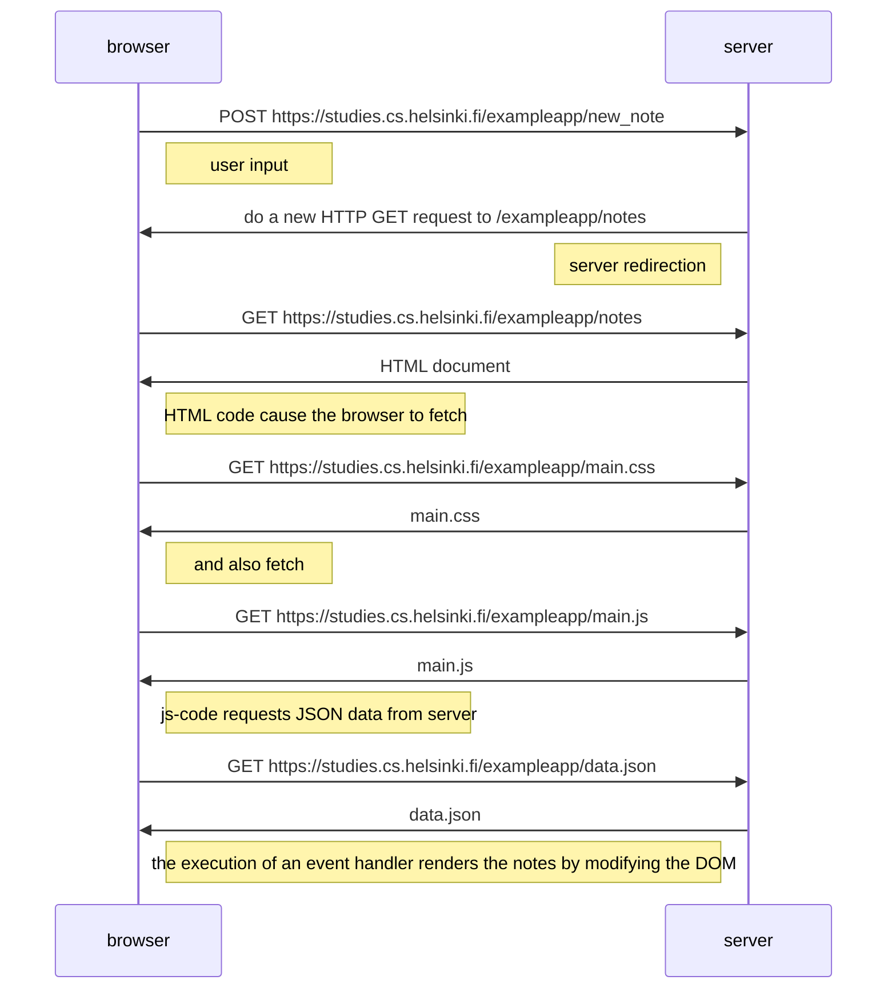

```mermaid

sequenceDiagram

    participant browser
    participant server
    
    browser->>server: POST https://studies.cs.helsinki.fi/exampleapp/new_note
    
	Note right of browser: user input
	
    server->>browser: do a new HTTP GET request to /exampleapp/notes
    Note left of server: server redirection

	browser->>server: GET https://studies.cs.helsinki.fi/exampleapp/notes
	
	server->>browser: HTML document

	Note right of browser: HTML code cause the browser to fetch

	browser->>server: GET https://studies.cs.helsinki.fi/exampleapp/main.css

	server->>browser: main.css

	Note right of browser: and also fetch 

	browser->>server: GET https://studies.cs.helsinki.fi/exampleapp/main.js

	server->>browser: main.js

	Note right of browser: js-code requests JSON data from server

	browser->>server: GET https://studies.cs.helsinki.fi/exampleapp/data.json

	server->>browser: data.json

	Note right of browser: the execution of an event handler renders the notes by modifying the DOM
    
    
```