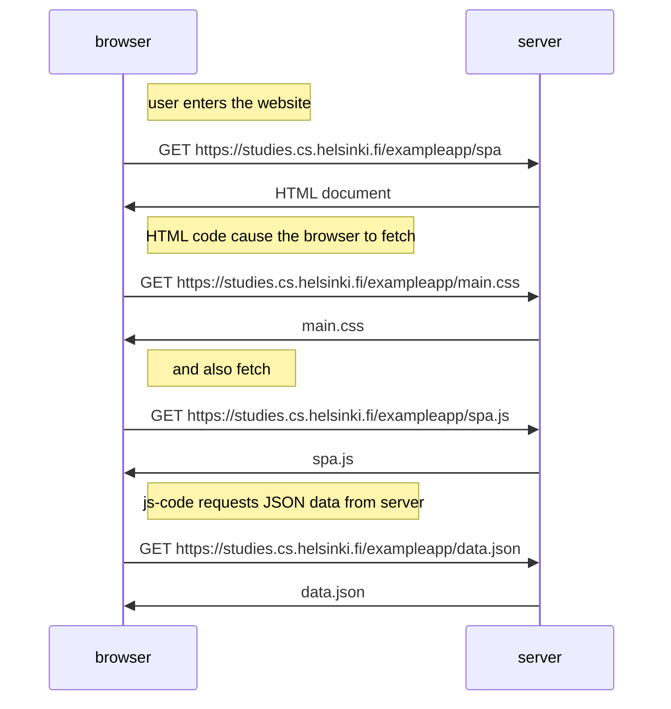

```mermaid

sequenceDiagram

    participant browser
    participant server

    Note right of browser: user enters the website
    browser->>server: GET https://studies.cs.helsinki.fi/exampleapp/spa

    server->>browser: HTML document

    Note right of browser: HTML code cause the browser to fetch
    browser->>server: GET https://studies.cs.helsinki.fi/exampleapp/main.css

    server->>browser: main.css

    Note right of browser: and also fetch
    browser->>server: GET https://studies.cs.helsinki.fi/exampleapp/spa.js

    server->>browser: spa.js

    Note right of browser: js-code requests JSON data from server
    browser->>server: GET https://studies.cs.helsinki.fi/exampleapp/data.json

    server->>browser: data.json

```