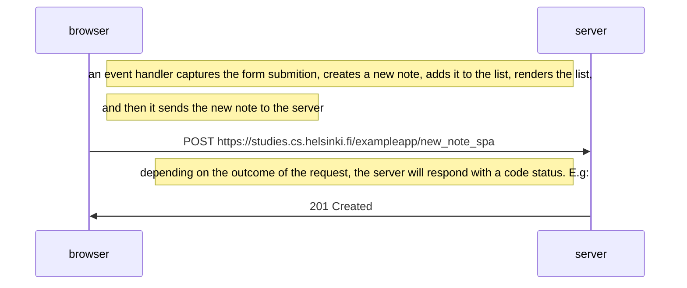

```mermaid

sequenceDiagram

    participant browser
    participant server

    Note right of browser: an event handler captures the form submition, creates a new note, adds it to the list, renders the list,
    Note right of browser: and then it sends the new note to the server
    browser->>server: POST https://studies.cs.helsinki.fi/exampleapp/new_note_spa

    Note left of server: depending on the outcome of the request, the server will respond with a code status. E.g:
    server->>browser: 201 Created

```